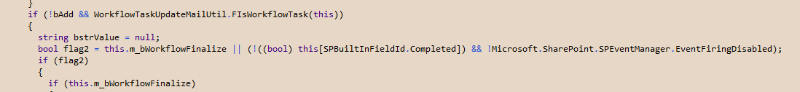

I&#8217;ve got a workflow where a project manager approves a project (that&#8217;s one kind of task), or can send it out for technical review (another kind of task), or can request more information from the user (yet another task). Each of these tasks have their own Content Type, and their own custom task edit form in ASP.NET. (Because I hate InfoPath with a burning white hot hate.)

Whenever someone uses one of these custom edit forms, however, I get a NullReferenceException. The stack trace always puts it in the non-public SPListItem.PrepeareItemForUpdate method. It doesn&#8217;t matter how I change the task list item. Using SPWorkflowTask.AlterTask, or just SPContext.Current.ListItem followed by Update all threw the NullReferenceException.

To Google I go! However, most of the results said that it had to do with not having a definition in the Content Types. That wasn&#8217;t my problem, however, since not only did my Content Types have FieldRef&#8217;s, but they were very much full.

At my wits end, I broke out the .NET Reflector and decompiled the Microsoft.SharePoint assembly. Here&#8217;s what I found:



As you can see (well, kind of see&#8230; click on it to see more clearly), this would only happen in a WorkflowTask. If the list item&#8217;s &#8220;Completed&#8221; field is null, the cast to bool throws a NullReferenceException. This is probably the kind of thing that can&#8217;t happen in SharePoint Designer, but only would occur when someone is mucking about in Visual Studio.

To fix it, make sure you set the &#8220;Completed&#8221; field. I do this:

```C#  
private void SetTaskStatus(string status, bool taskIsComplete) {  
  SPListItem taskItem = SPContext.Current.ListItem;

  Hashtable taskData = new Hashtable();  
  taskData[SPBuiltInFieldId.TaskStatus] = status;  
  taskData[SPBuiltInFieldId.Completed] = taskIsComplete;  
  if (taskIsComplete) {  
    taskData[SPBuiltInFieldId.PercentComplete] = 1;  
  }

  SPWorkflowTask.AlterTask(taskItem, taskData, true);  
}  
```

Or, if you work for Microsoft, you could do us a favor and make sure that you null check that line and default to false. (It&#8217;s entirely possible that this has been fixed by SP1, but my production server doesn&#8217;t run that yet, so I can&#8217;t either.)