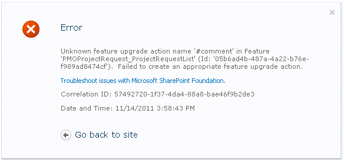

So I&#8217;m doing new work on a SharePoint feature that&#8217;s already deployed, so naturally, I have to do some upgrade actions to deploy some new fields to a content type. There are a few fields to add, and since the AddContentType field doesn&#8217;t have any naming elements, I decide to throw in some comments before each entry, so I know which field is which and I make sure I haven&#8217;t forgotten any. Everything compiles fine and Update-SPSolution works fine. Then, I try to run my upgrade and I get the following error:

Really, SharePoint? You can clearly _see_ that it&#8217;s a comment, and yet you still just barf on it rather than just ignoring it. WHY!?