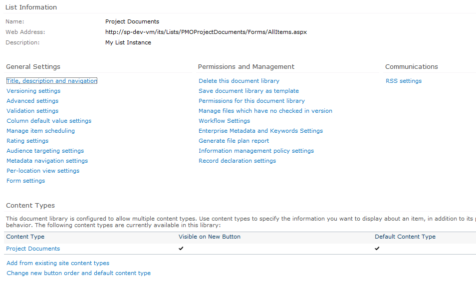
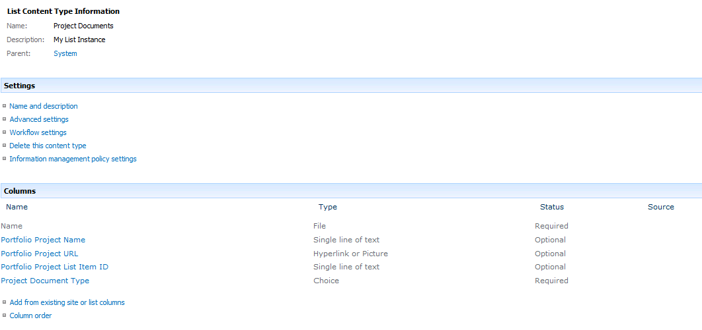
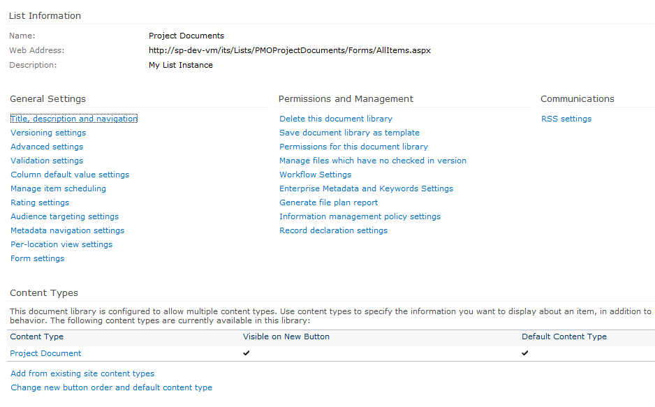
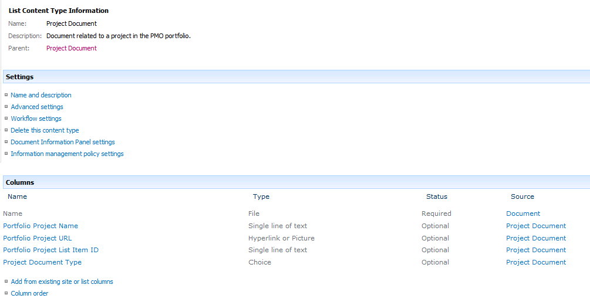

So, we all love the way Visual Studio 2010 allows us to debug our SharePoint code with a single bounce on the F5 button, right? Isn&#8217;t it nice the way we can deploy with confidence, knowing that we debugged our code in the dev environment? Surely, our code and configurations will act exactly the same way when we deploy them with Add-SPSolution as they do when we deploy them with F5. Right?

Well then what the hell is up with this:

I&#8217;m doing something that I think is pretty typical. I&#8217;ve created a content type, descended from Document, to go into a document library, like so:

```xml  
<?xml version="1.0" encoding="utf-8"?>
<Elements xmlns="http://schemas.microsoft.com/sharepoint/">  
<!-- Parent ContentType: Document (0x0101) -->
  <ContentType ID="0x010100abd74e6994114664b1ca6a8a710ff8cb" Name="Project Document" Group="WMC Project Management" Description="Document related to a project in the PMO portfolio." Inherits="TRUE" Version="0">  
    <FieldRefs>  
      <FieldRef ID="{B61A9DBA-5714-4E44-98AE-D410F84874BB}" Name="PortfolioProjectName" DisplayName="Portfolio Project Name" />  
      <FieldRef ID="{811A8F99-3336-41AF-A1B1-C9DC624085C2}" Name="PortfolioProjectUrl" DisplayName="Portfolio Project URL" />  
      <FieldRef ID="{938CF8E5-CCB2-49B1-91A6-595EB741F532}" Name="PortfolioProjectListItemId" DisplayName="Portfolio Project List Item ID" />  
      <FieldRef ID="{9BE2CEAE-351D-4BC1-881B-44C7091FD501}" Name="ProjectDocumentType" DisplayName="Project Document Type" />  
    </FieldRefs>  
  </ContentType>  
</Elements>  
```

And I&#8217;ve created a document library to hold documents of this content type, like so:

```xml  
<?xml version="1.0" encoding="utf-8"?>
<List xmlns:ows="Microsoft SharePoint" Title="Project Documents" Direction="$Resources:Direction;" FolderCreation="TRUE" EnableContentTypes="TRUE" Url="PMOProjectDocuments-ProjectDocumentLibrary" BaseType="1" xmlns="http://schemas.microsoft.com/sharepoint/">  
  <MetaData>  
  <ContentTypes>  
    <ContentTypeRef ID="0x010100abd74e6994114664b1ca6a8a710ff8cb" />  
  </ContentTypes>  
  <Fields>  
    (blah blah blah)  
  </Fields>  
  (blah blah blah blah blah)  
  </MetaData>  
</List>  
```

So can you tell me why I see the following when I hit my F5 key?



Hm, that&#8217;s odd. I called my content type &#8220;Project Document&#8221; not &#8220;Project Documents.&#8221; Project Documents is the name of the document library itself. Let&#8217;s take a closer look at that content type, shall we?



What the WHAT? That&#8217;s no content type, that&#8217;s a list instance! I wondered what I&#8217;d done wrong. It&#8217;s certainly not out of the question for me to screw up a SharePoint XML configuration somewhere. Hell, screwing that up is most of what I do all day. So I went to my test server, where I&#8217;d deployed a slightly different earlier version. The document library and content type appeared normal. Could there possibly be some difference in the way I deployed the project? I deployed the .wsp manually on the dev box&#8230; the very same .wsp I&#8217;d just debugged with F5.



But that looks perfectly normal. What about the content type itself?



So&#8230; I guess this means I can&#8217;t trust content deployed through Visual Studio anymore. Hey, it&#8217;s not like I needed a streamlined workflow or anything.