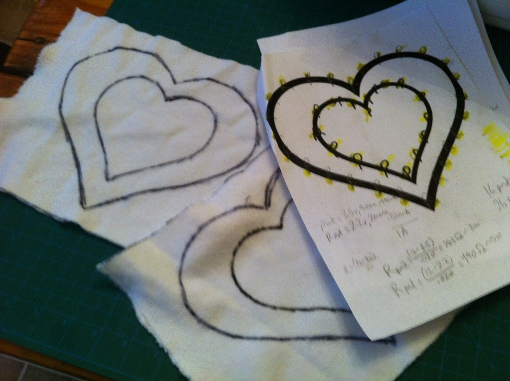
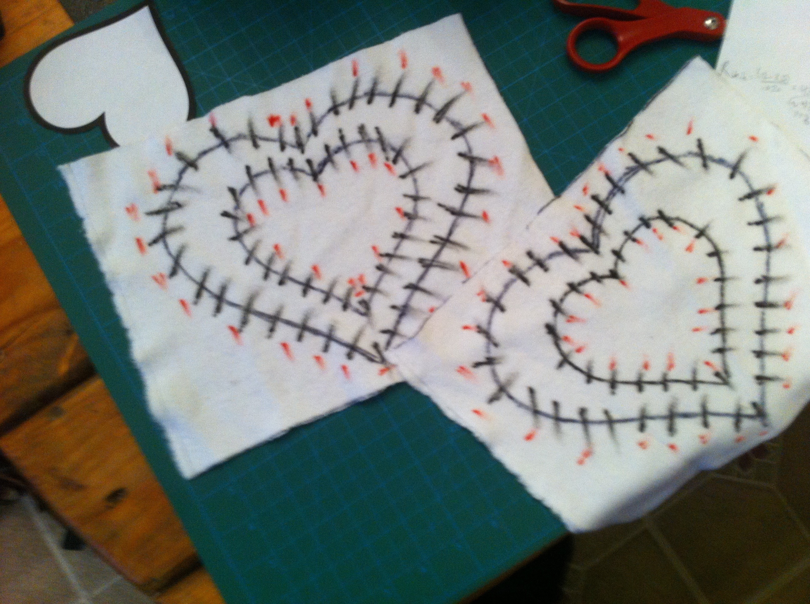
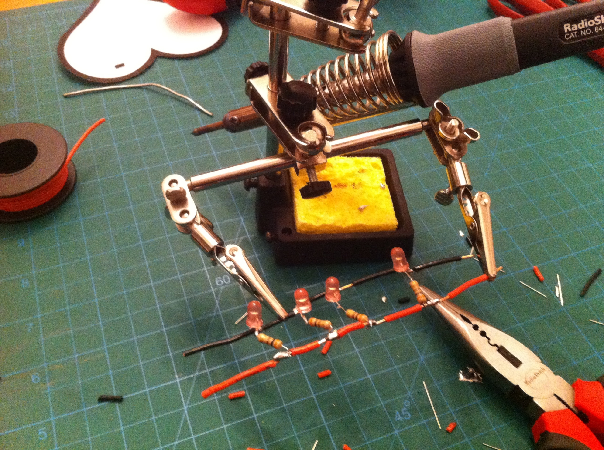
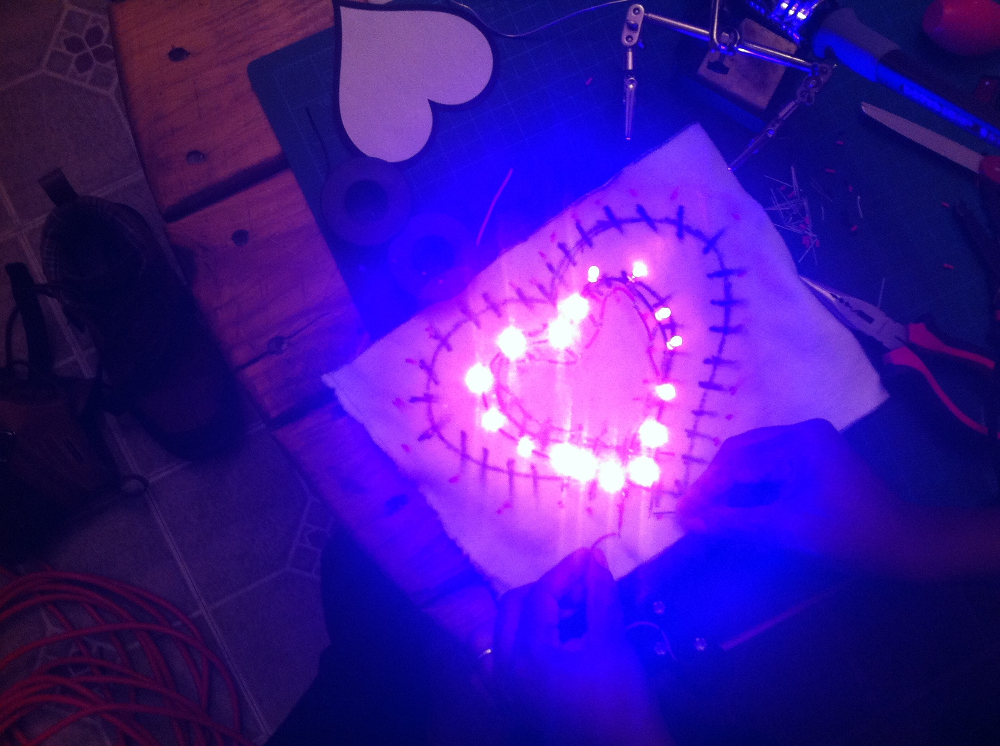
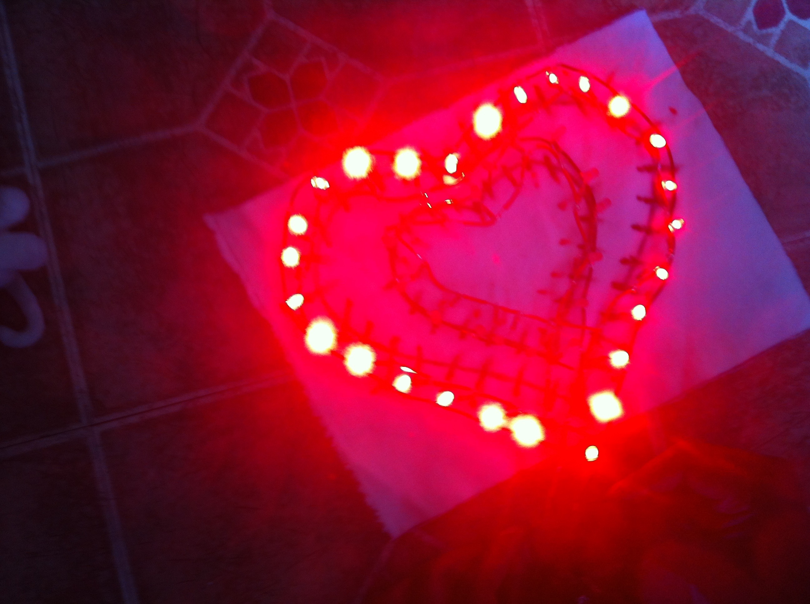
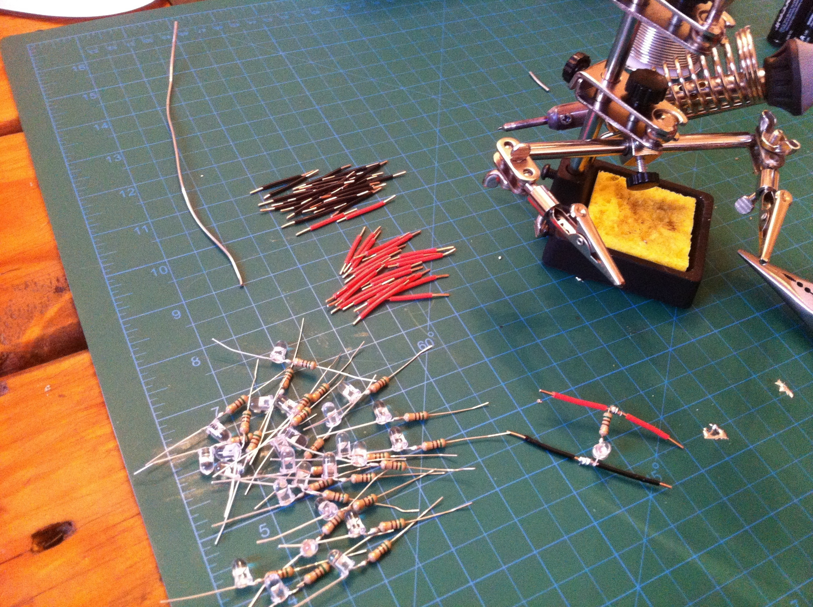

The show was last night, and was a smashing success, and so it&#8217;s time to reveal the project that I&#8217;ve been working tirelessly on in the past week.

The idea of &#8220;Yes! Yes! Yes! And&#8230;&#8221; is kind of a sexy party improv show. (Notably, and importantly, I think, the improv itself is 100% clean, it&#8217;s just the &#8220;frame story&#8221; that&#8217;s all sexy.) The theme of this show was that it would be performed in total darkness, with the performers illuminated only by small LEDs that they carried with them.

With my knowledge of electronics, I figured I could do something pretty neat. My idea was that, as our hearts and our libidos are often in conflict, the suit will display the beating heart and the prominent&#8230; genitalia. (Due to the nature of the show, this post will be filled with the forced hesitant prudishness of the ellipsis.) 

Here&#8217;s a [video of the completed LED bodysuit.](https://www.dropbox.com/s/05hwpqr6ku3wm3z/Video%20Feb%2016%2C%206%2048%2050%20PM.mov)

So the first thing I did was I built a boatload of LED strands. Why not just buy LED rope lights? My thought was that I wanted to determine exactly what color and design I wanted (which I was right about) and that it wouldn&#8217;t be a big deal to solder them all together. About this last point I was wrong. Dead, dead, wrong. It took me three solid days to solder together two hearts, one male, and one female&#8230; piece. (There&#8217;s that ellipsis again.)

I ordered a bunch of colored LEDs and resistors from Mauser. Here&#8217;s some of the first designs, with my calculations of the resistance values for a 12-volt input.

Here is the soldering station, just beginning the build of a strand of lights. Again, I spent three solid days doing this.

Here&#8217;s the first successful test of the &#8220;inner&#8221; heart ring.

And this is the outer.

Here is a pile of hand-soldered LED and resistor assemblies, ready to put into a cable that&#8217;s being built.

The heartbeat is controlled by a super-simple controller board. The 12v is routed through a 5v voltage regulator, which feeds the input of an ATtiny 85. (I programmed the ATtiny 85 through my Arduino. Much thanks to [High-Low Tech at the MIT Media Lab](http://hlt.media.mit.edu/?p=1695) for showing me how to do that.) The output pins 0 and 1 go to the base of two transistors, whose collectors are pointed at the 12v supply and whose emitters are pointed at the inner and outer heart rings.

The&#8230; bits&#8230; are directly wired in without a controller. 

To make sure that we could turn the whole thing on and off at a moments notice, I wired a toggle switch for the whole shebang, and routed it into the left arm.

There were some important lessons learned. First, and most vitally important lesson is that I can NOT solder a million tiny connections in any reasonable amount of time. 

Another lesson was that, while it&#8217;s nice to have guaranteed battery supply, having a 10 Amp-hour battery is not only probably overkill, but those batteries in NiMH weigh about 4 lbs. In the end, I couldn&#8217;t even get them to charge (my charger was defective, and is being returned). But even if I&#8217;d gotten them to charge, I never solved the problem about how someone would actually wear such a battery pack. I&#8217;ll most certainly use the two huge battery packs in some future project&#8230; I&#8217;d better&#8230; they were darn expensive! In the end, I just ended up using 8 long-lasting AA batteries to generate 12v.

Yet another lesson: Stripboard is much easier to work with than undifferentiated perfboard. At the very least it focuses the mind as to where your components should go. I&#8217;ve heard that custom printing PCBs isn&#8217;t terribly difficult or expensive, and I may need to look in to that.

On the brighter side of lessons learned: The fact that I don&#8217;t need to stick a whole Arduino into a project! It was extremely easy to built a breadboard to program the ATtiny 85 and upload my sketch to it. And the ATtinys are so cheap, I purchased 10. (And blew up two. Don&#8217;t forget to connect the ground wire to your 5v regulator, folks! Whoops!) But I will almost certainly be using ATtinys (or other Amtel chips I can program from the Arduino) in future projects.

My heart was having shorting problems, but it worked with a little bit of fiddling during the show, and finally died in the shows final few minutes, so I guess we got just about all I can ask of my meagar soldering and board-building skills.

In the end, it didn&#8217;t quite live up to my initial imagination. (I&#8217;d planned on having LEDs running down each arm and leg. That would have been an additional hundred LEDs to solder!) But it came out pretty awesome just the same. I&#8217;m super-proud of this, and while I don&#8217;t think that I&#8217;m going to be doing this all the time, it&#8217;ll be a neat thing to throw into my performances now and again.