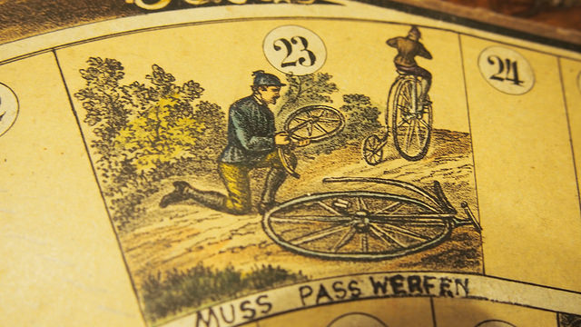

I&#8217;ve only been a consultant for about a year now, but I&#8217;ve been performing improv comedy for about twenty. And as I work more in consulting, I&#8217;m starting to see that consulting and improv comedy aren&#8217;t so different.

One trap that beginning improvisers tend to get caught up in is the idea that the arbitrary, imaginary thing that they&#8217;re doing is actually the important part of the scene. It&#8217;s not. The imaginary thing is just a vehicle that helps us explore human relationships and emotions. It&#8217;s the set dressing around which we build the characters that the audience really wants to see.

There&#8217;s an old improv coaching idiom that I use often: An audience never leaves an improv show saying, &#8220;Yeah, it was funny and all, but they never \*did\* finish putting together that bicycle!&#8221; Sure, come on stage and start building a bicycle, if that&#8217;s what the moment has inspired you to do. But we want to see how these particular characters react to building a bicycle.

_Courtesy https://www.flickr.com/photos/radlmax/21830232766 (CC BY-ND 2.0)_

Similarly, when you&#8217;re on a consulting gig, if you&#8217;re talking to the real decision makers, they don&#8217;t care about technology. They only care about what the technology does for their business. No CEO ever leaves a post-engagement meeting saying, &#8220;Yeah, we made a million dollars, but we never \*did\* use SharePoint!&#8221;

As technical consultants, it&#8217;s easy for us to get enmeshed in the minutia of technology. After all, that expertise is what they&#8217;re hiring us for, right? Wrong. They&#8217;re hiring us because we know how to use technology as a lever. Technology is a tool. If it doesn&#8217;t serve a useful business purpose, it&#8217;s a toy.

I&#8217;m a SharePoint developer, and my hammer is Visual Studio and when I have my tech-blinders on, everything can look like a nail. When you bring me in, chances are that someone&#8217;s already decided that their project is going to live on SharePoint. My instinct isn&#8217;t to argue with you. Who doesn&#8217;t love those juicy billable hours? But as a good consultant, I hope to be a trusted adviser to my clients. It&#8217;s my responsibility to say when SharePoint ain&#8217;t the tool for the job, even at the cost of billable hours. Hell, even at the cost of the whole gig. If someone respects the integrity of your advice, there will be work for you some other day.

Just like in improv, it&#8217;s the relationship that&#8217;s the important thing. It&#8217;s not about the bicycle. It&#8217;s about getting where you want to go.