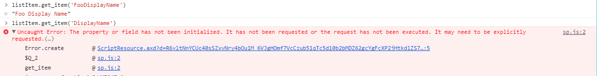

https://twitter.com/Bob1German/status/776810967183323136

Sometimes I feel bad for junior front-end developers who think they have a decent handle on things, and then get thrown into the world of SharePoint. They don&#8217;t have the SharePoint Spidey-sense that tells them something simple is going to go horribly wrong.

I was called on to assist a junior developer who was tearing his hair out trying to do simple CRUD operations on list items in SharePoint in an Angular application. I&#8217;d already written a (somewhat) simplifying Angular service to deal with most of the annoying parts of the REST API, so I was baffled that he was having so much trouble with it.

So I stepped into the code with him, making sure he was calling my service correctly. He was. I began to panic. Was there a bug in my service? I stepped into the service code. Everything looked fine, and SharePoint returned the proper &#8220;201 CREATED&#8221; response. But every field except one was being set.

The name of that field was &#8220;DisplayName&#8221;.

Curious.

I proceeded to create a new Custom List called &#8220;TestThisBug.&#8221; I created a field called &#8220;DisplayName&#8221; and another field called &#8220;FooDisplayName.&#8221; 

Simple, right? Then I tried to get the fields via the REST API.

The field did not appear. Curiouser and curiouser.

I tweeted the tweet above, and told the developer to name the field something else and be on his way. I wondered, &#8220;What if we try the same operations using the JSOM?&#8221;

So, on my SharePoint 2013 VM, I fired up a Site Collection, created my list, and wrote me some JSOM code. I wrote some code that will get that list item, select a few fields (including &#8220;DisplayName&#8221;) and just display it in a table.

I got every field I asked for, except for &#8220;DisplayName&#8221; which was silently disregarded. When I tried to ask for it directly via `get_item('DisplayName')` I was told it wasn&#8217;t initialized, despite the fact that I&#8217;d explicitly requested it.

I began to wonder if I would run into the same _creation_ issue my coworker was encountering. I wrote some more JSOM code to actually create a list item with the &#8220;DisplayName&#8221; field set. And, even more strangely&#8230; It worked!

I then logged on to my Office 365 Dev Tenant to see if this is still an issue.

Yup! Sure is! You can see here that I can get the field name from the list via `list.get_fields()`, but when I return list items, the field is not returned, despite explicitly requesting it. You can also see that the &#8220;DisplayName&#8221; field that is returned from `get_fields()` doesn&#8217;t have any super-secret internal name that I&#8217;m missing.

But, as before, adding a list item with that field via JSOM works just fine:

So, kids, I guess the moral of this story is pretty simple: Don&#8217;t name your fields &#8220;DisplayName.&#8221; 

Here&#8217;s the bug-test JSOM code.

`gist:340f2efbbd65d21a533719fbd508d98e`