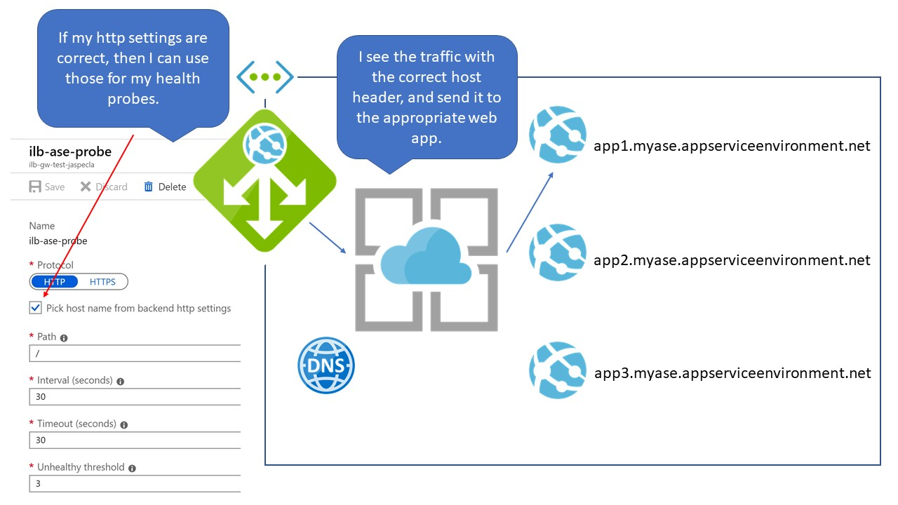

When is an App Service not an App Service?  When it's an Application Service Environment with its own Internal Load Balancer on your internal Virtual Network.

(It's very un-Microsoft of me, but I actually spelled out the acronyms I'm about to use.  But from now on, let's call it an ILB ASE.)

There are many online tutorials for setting up an ILB ASE to respond to requests over the public Internet by using an App Gateway.  Here's [an Azure Friday with Christina Compy from the product group](https://azure.microsoft.com/en-us/resources/videos/azure-friday-ilb-ase-and-application-gateway-compy/).  Here's [a blog writeup from the Azure Tech Guy](https://azuretechguy.com/ilb-ase-application-gateway-waf).  

But I didn't read those.  I *did* read the [ASE docs](https://docs.microsoft.com/en-us/azure/app-service/environment/create-ilb-ase) and the guide to [integrating ILB ASE with App Gateway](https://docs.microsoft.com/en-us/azure/app-service/environment/integrate-with-application-gateway) and all of the [App Gateway documentation](https://docs.microsoft.com/en-us/azure/application-gateway/overview).  

This is *not* a tutorial about setting up the ILB ASE with App Gateway.  It's an exploration of what I got wrong when learning to set it up in hopes that my misconceptions can lead to a deeper understanding.

The big idea of what I was trying to create is this:

When I first tried to build this, I thought, "Hey!  I'm a smart guy!  I should be able to figure this out, and then refer to the documentation when I can't."  Following the documentation, I created an ILB ASE, created an App Service Plan in the ASE, and a Web App in the App Service Plane.

I set up a Windows 10 machine inside the VNet to test accessing the ASE directly, and to use as an Azure Piplelines build and release agent.  I fired up a Linux box to serve as the DNS server for the VNet (because I used to be a UNIX guy and spent way too much time configuring BIND) and created the DNS zones for myase.appserviceenvironment.net and myase.scm.appserviceenvironment.net.  I followed the [ILB ASE DNS configuration documentation](https://docs.microsoft.com/en-us/azure/app-service/environment/create-ilb-ase#dns-configuration).  That part worked great.  I could access the web apps on my ASE from my internal VNet.

Now, to make the app visible from the outside.  To that, I turned to the App Gateway.

### Misconception One: If I Select the App Service for My Backend Pool, App Gateway Knows How to Reach It

All of the guides on the internet properly say to put the ILB ASE's internal IP address as the target.  But I cocksurely skimmed those guides, and saw that in the dropdown, I could select "App Services."  Hey!  An App Service Environment is an App Service, right?  And when the UI changes to select an App Service, the App Services in the ILB ASE appear as selectable items.  SCORE!

*DO NOT DO THIS.  THIS IS WRONG.*

It's very helpful, but it doesn't work.  It's asking for a "valid internet hostname."  My ILB ASE has a hostname, but it's only available on my private DNS in my VNet.  

I *assumed* that showing the ILB ASE websites in this menu meant that App Gateway knows how to reach them by looking up the IP address associated with the ILB ASE they belong to.  But it doesn't, and that's why all the examples specifically tell you to enter the private IP address of the ILB ASE here.

### Misconception Two: The Host Name in the Listener Refers to a Backend Pool

I mean, with a tooltip like that, can you *blame* me?

The "Host name" here refers to the hostname that the App Gateway (and not the ILB) will be listening for.  Just like the ILB (and App Service in general), App Gateway listens on one IP address and port for multiple websites, and distinguishes between them via the host header.

### Misconception Three: HTTP Settings Can Resolve Internal Hostnames

That "Use for App service" setting is so tempting to click!  And when I did, it automatically selected "Pick host name from backend address for you."  Makes sense, if your logic works like mine.

**My Logic**: Since I selected the Web App in the dropdown, Azure knows all about it.  It knows it's associated with an ILB ASE, it knows the ILB ASE's internal IP address (misconception one) and it knows what host header the web app is expecting.

**Azure**: WRONG!  I can't resolve internal DNS names.  You have to give me an IP.  And since the backend address is an IP, I have no idea what to put into the host header if you select "Pick host name from backend address."

The HTTP settings *can* get the proper host header in one of two ways: 

1. The host name of the Web App in the ILB ASE is the same as the one used for the App Gateway's listener as described above.
2. You specifically override the host name to be the one the ILB ASE Web App already knows about, be it the appserviceenvironment.net name or one you created yourself.

### Misconception Four: The Host Part of the Health Probe is Resolved

Putting the internal hostname here *does* work, helping enforce the misconception that the App Gateway can resolve internal DNS names if they're associated with an App Service through some Azure Magic.  But this is not so.  The "Host" here is only what's put in the host header.  It is the settings in the backend pool that matter, and the backend pool needs the internal IP address.

What you *can* do here is check the box that reads "Pick host name from backend http settings."  If your HTTP settings know what to use for the host header as described above, then the health probe will use those settings.

### Misconception Five: The ILB ASE Needs to Know About the External Host Name

All of the tutorials I've found, including the one I linked to, tell you to set your custom domain in your web app in the ILB ASE and upload the certificate there.  But that's not necessary anymore.  The ILB ASEs now come with an appserviceenvironment.net hostname, and Azure is loaded with a wildcard cert for that domain.  The internal web app doesn't need to know a thing about the external hostname or certificate.

## Diagrams: The Right Way to Do It

Configure the listener:

Configure the backend pool:

Configure the http settings:

Configure the custom health probe:

